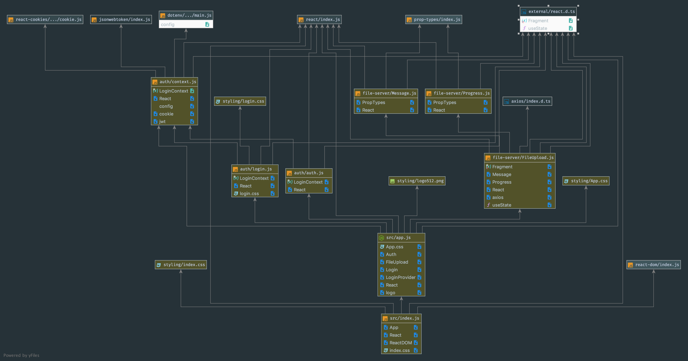

# Mi-Pi-Cloud

 ## Client

 ### Author: Evan Brecht-Curry

 ### Links and Resources
* [submission PR](https://github.com/evan-401-advanced-javascript/lab-34-Redux/pull/1)
* [travis](https://www.travis-ci.com/evan-401-advanced-javascript/lab-34-Redux)
* [netlify](https://naughty-bose-3bb42a.netlify.com) 
* [docs]( http://localhost:6060/)

 ##### Exported Values and Methods

### Setup
* `npm install --save-dev react-styleguidist`
* `npx styleguidist server`

#### `.env` requirements

 #### UML
